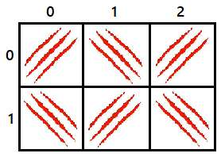

Nagol

Nagol, um ex super-herói que todos acham estar morto, mora em uma calma cidade do interior de Minas. Após se aposentar da agitada vida de herói, ele agora trabalha como designer de azulejos. Iremos imaginar uma parede de azulejos como um grid de $L \times C$, $L$ linhas identificadas de 0 a $L-1$ e $C$ colunas identificadas de 0 a $C-1$.

Nagol possui um estilo próprio de design, ele usa suas mãos para “riscar” cada um dos azulejos e transformar a parede final em uma grande obra de arte.

A ordem que ele usa para fazer isso é sempre a mesma, começa da primeira linha e vai riscando todas as $C$ colunas da esquerda para a direita, depois vai para a segunda linha e risca todas as $C$ colunas do mesmo modo, isso se repete até terminar as $L$ linhas.

Um detalhe importante é que ele nunca faz dois riscos seguidos com a mesma mão, ele alterna começando sempre com a direita.

Segue um exemplo de uma parede final onde $L = 2$ e $C = 3$:

Exemplo de parede: $L = 2$ e $C = 3$

Sua tarefa é, dado o tamanho da parede ($L$ e $C$) e a posição de um azulejo específico ($X$ e $Y$), diga qual mão Nagol usará para riscá-la.

### Entrada

Cada linha da entrada possui quatro inteiros $L ( 0 < L , C < 10^5 ), X ( 0 \le X < L ), Y ( 0 \le Y < C )$, todos descritos anteriormente.

### Saída

Exiba uma única linha com a mensagem “Direita”, caso ele tenha riscado o azulejo com a mão direita ou “Esquerda”, caso contrário.

| Entrada |    Saída |
|--------:|---------:|
| 2 3 0 1 | Esquerda |

| Entrada |   Saída |
|--------:|--------:|
| 4 4 2 2 | Direita |
